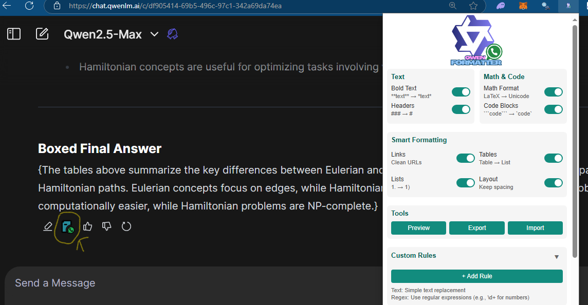
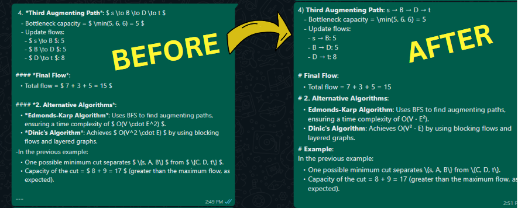

# QwenLM WhatsApp Formatter

A browser extension that automatically formats text copied from QwenLM Chat for WhatsApp compatibility. Perfect for students who use QwenLM to summarize study materials and share them via WhatsApp.


## 🌟 Features

- **Smart Text Formatting**
  - Converts double asterisks (`**text**`) to WhatsApp-style bold (`*text*`)
  - Simplifies multiple header symbols (`###`) to single ones
  - Transforms complex tables into readable bullet lists
  - Handles math expressions and code blocks cleanly

- **Customization Options**
  - Add custom formatting rules
  - Preview formatted text
  - Import/Export settings
  - Smart link formatting





## 📥 Installation


### Microsoft Edge
1. Visit [Edge Add-ons Store](store-link) *(Coming Soon pending review)*
2. Click "Add to Edge"


### Manual Installation

#### Chrome
1. Download the [latest release](releases-link)
2. Unzip the file
3. Open Chrome and go to `chrome://extensions/`
4. Enable "Developer mode" (top-right toggle)
5. Click "Load unpacked"
6. Select the unzipped extension folder
7. The extension icon should appear in your toolbar

#### Microsoft Edge
1. Download the [latest release](releases-link)
2. Unzip the file
3. Open Edge and go to `edge://extensions/`
4. Enable "Developer mode" (left sidebar)
5. Click "Load unpacked"
6. Select the unzipped extension folder
7. The extension icon should appear in your toolbar

#### Firefox
coming soon..


## 🚀 Usage

1. Open [QwenLM Chat](https://chat.qwenlm.ai)
2. Copy any text from the chat
3. The extension automatically formats the text for WhatsApp
4. Paste into WhatsApp - enjoy clean formatting!

### Customizing Settings

1. Click the extension icon in your browser toolbar
2. Toggle various formatting options:
   - Bold Text
   - Headers
   - Math Format
   - Code Blocks
   - Smart Links
   - Tables
   - Lists
   - Layout Spacing
3. Add custom formatting rules if needed
4. Use the preview feature to test your settings

## 🛠️ Development Setup

If you want to modify the extension:

1. Clone the repository
```bash
git clone https://github.com/Shery-1508/qwen-formatter.git
```

2. Install dependencies (if any are added in future)
```bash
cd qwen-formatter
npm install
```

3. Load the extension in your browser following the manual installation steps above

4. Make your changes and reload the extension to test

## 📝 Files Structure

```
qwen-formatter/
├── manifest.json        # Extension configuration
├── popup.html          # Settings popup interface
├── popup.js            # Settings functionality
├── inject.js           # Core formatting logic
├── icon.png            # Extension icon
└── README.md          # This file
```

## ⚠️ Known Issues

- Tables with complex layouts might need manual adjustment
- Some math expressions might require tweaking
- Firefox temporary installation needs to be reloaded after browser restart

## 🤝 Contributing

Contributions are welcome! Please feel free to submit a Pull Request.

1. Fork the repository
2. Create your feature branch (`git checkout -b feature/AmazingFeature`)
3. Commit your changes (`git commit -m 'Add some AmazingFeature'`)
4. Push to the branch (`git push origin feature/AmazingFeature`)
5. Open a Pull Request

## 📄 License

This project is licensed under the MIT License - see the [LICENSE](LICENSE) file for details.

## 🙏 Acknowledgments

- Thanks to all students who provided feedback
- QwenLM Chat for being an excellent study tool
- The browser extension development communities

## 📞 Contact

Sheharyar - [Your LinkedIn/Twitter/Contact Info]

Project Link: [https://github.com/Shery-1508/qwen-formatter](https://github.com/Shery-1508/qwen-formatter)

---

Made with ❤️ by Sheharyar
